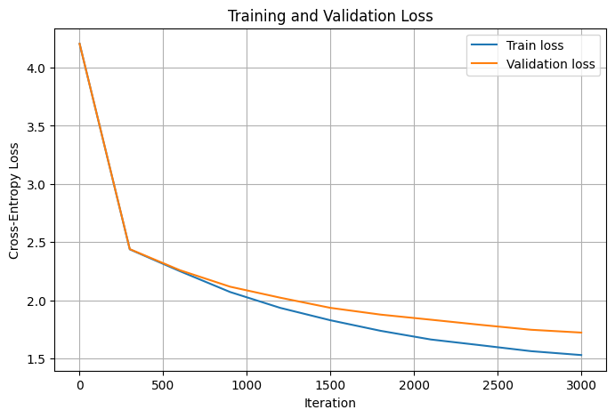
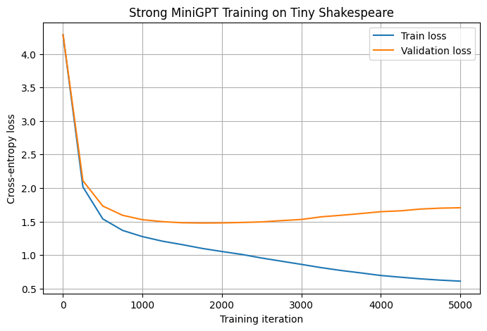

# Summary

MiniGPT is an open, Colab-runnable learning module for rebuilding a small GPT-style autoregressive language model from scratch in PyTorch. The module is provided as a single notebook, `MiniGPT_Notebook.ipynb`, so learners can run the full workflow without creating a local environment or installing a separate dependency stack.

The notebook guides learners through the main parts of a decoder-only Transformer language model: character-level tokenization, token and positional embeddings, causal multi-head self-attention, Transformer blocks, next-token cross-entropy training, validation loss tracking, checkpoint selection, and autoregressive text generation. The implementation follows the high-level design ideas of GPT-style models [@radford2019language] and nanoGPT [@karpathy2022nanogpt], but the model and training code are written independently for learning purposes. The module uses PyTorch [@paszke2019pytorch] and Jupyter notebooks [@kluyver2016jupyter] because the goal is to keep the explanation, code, output, and generated samples in one place.

MiniGPT uses the Tiny Shakespeare dataset with character-level tokenization [@karpathy2015charRNN]. Character-level modeling is simple and transparent, and previous work also shows that self-attention can learn useful structure from character sequences [@alrfou2018character]. In this module, a baseline MiniGPT model verifies the full training pipeline, while a stronger configuration shows how model capacity, context length, learning-rate scheduling, dropout, gradient clipping, and validation-based checkpoint selection affect loss curves and generated text.

# Statement of Need

GPT-style language models are often introduced through high-level diagrams, large libraries, or full training repositories. These resources are useful, but they can be hard for learners who want to see the complete path from raw text to generated samples. MiniGPT addresses this gap by giving a compact worked example where every important step is visible inside one notebook.

The target audience is advanced undergraduate students, graduate students, instructors, and practitioners who want a practical introduction to autoregressive Transformer language modeling. The module is not meant to be a new language-model architecture or a state-of-the-art benchmark. Its purpose is to support computationally enabled learning: learners rebuild the model, train it, inspect its loss curves, and generate text from the trained checkpoint.

This module can be adopted in a course on deep learning, natural language processing, or deep generative models. It can also be used as a short workshop or self-study exercise. A teacher can run only the baseline model for a shorter lab, or include the stronger model to discuss overfitting, checkpoint selection, and sampling behavior.

# Target Audience and Learning Goals

Learners should already know basic Python and should have a basic understanding of neural networks. Prior experience with PyTorch is useful, but the notebook explains the implementation step by step.

After completing the module, learners should be able to:

- explain how raw text is converted into character-level token IDs;
- implement token embeddings and positional embeddings;
- explain why causal masking is needed for next-token prediction;
- build a Transformer block with self-attention, MLP layers, residual connections, and LayerNorm;
- train a GPT-style model using next-token cross-entropy loss;
- read training and validation loss curves;
- use validation loss to select a checkpoint;
- generate text autoregressively and explain the effect of sampling temperature.

# Content

The learning module is organized as a worked example. It starts with the model components, then builds the training pipeline, then studies results and generated text.

| Part | Content | Learner activity |
|---|---|---|
| 1 | Minimal GPT model | Implement attention, Transformer blocks, full MiniGPT model, and causal mask checks |
| 2 | Training pipeline | Load Tiny Shakespeare, tokenize text, create train/validation splits, sample next-token batches, and train a baseline model |
| 3 | Stronger experiment and generation | Train a stronger model, select the best validation checkpoint, generate text, and compare sampling settings |

The baseline model has 826,433 trainable parameters and reaches a validation loss of 1.7236 after 3000 iterations. The stronger model has 10.77M parameters and reaches a best validation loss of 1.4780 at step 1750. The stronger model later overfits, so the notebook uses the validation minimum rather than the final training step.

| Setting | Baseline MiniGPT | Stronger MiniGPT |
|---|---:|---:|
| Dataset | Tiny Shakespeare | Tiny Shakespeare |
| Tokenization | Character-level | Character-level |
| Vocabulary size | 65 | 65 |
| Context length | 128 | 256 |
| Batch size | 32 | 64 |
| Parameters | 826,433 | 10.77M |
| Training iterations | 3000 | 5000 |
| Checkpoint used | Final step | Best validation checkpoint |
| Best/final validation loss | 1.7236 at step 3000 | 1.4780 at step 1750 |
| Validation perplexity, `exp(loss)` | 5.60 | 4.38 |
| Training time on Colab A100 | 50.79 seconds | 4.76 minutes |

The figures are included to make the learning behavior visible. The baseline curve shows steady improvement. The stronger curve shows faster learning but also overfitting after the best validation checkpoint. This gives learners a clear example of why validation tracking matters.

# Usage and Adoption

To use the module, learners open `MiniGPT_Notebook.ipynb` in Google Colab, select a GPU runtime if available, and run the notebook cells from top to bottom. The notebook downloads the dataset, builds the tokenizer, trains the models, plots the loss curves, and generates text samples. The reported times were measured on a Colab A100 GPU, but the baseline experiment can also be used as the faster teaching option.

For instructors, the notebook can be used as a guided lab. The first part can be assigned before class to study the architecture. The training and generation sections can be used in class to discuss loss curves, generalization, overfitting, and sampling. The full repository is available at [@joseph2026minigpt].

# Conclusion

MiniGPT provides a compact learning module for rebuilding the main GPT-style language-modeling pipeline from first principles. It connects the architecture, training loop, validation process, and generation behavior in one runnable notebook. The module does not claim architectural novelty. Its contribution is to make the full workflow easy to inspect, run, and adapt for teaching or self-learning.

# Author's Contribution

Jibin Joseph created the MiniGPT notebook, implemented the model and training pipeline, ran the experiments, prepared the repository materials, and wrote the JOSE paper.

# Acknowledgements

This module was developed from coursework in Advances in Deep Generative Models at The University of Texas at Austin. The design was conceptually inspired by Andrej Karpathy's nanoGPT repository and related GPT-from-scratch educational material, while the notebook implementation was written independently.

# References
